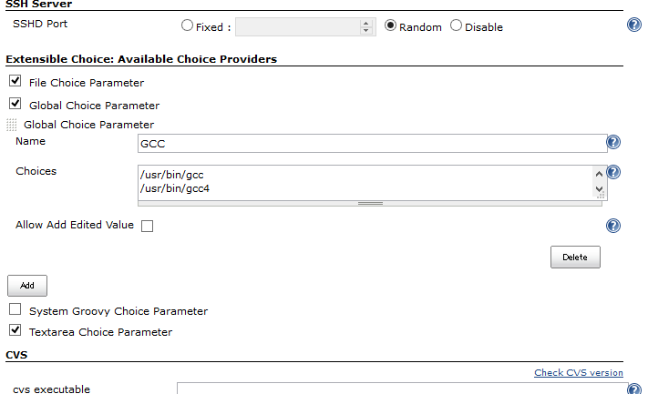
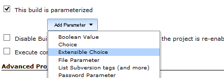
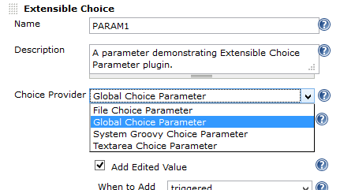
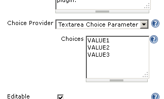
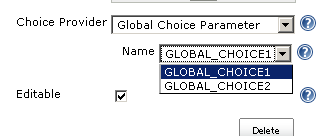
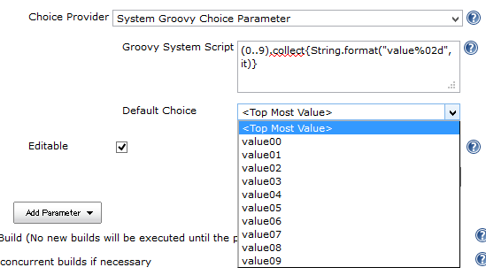
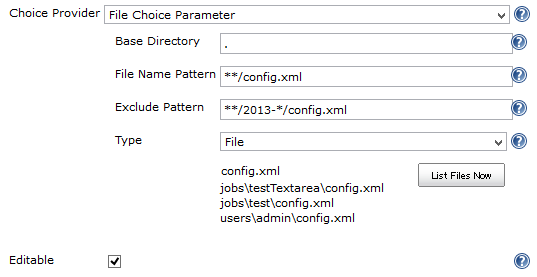
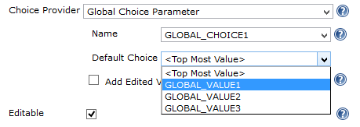
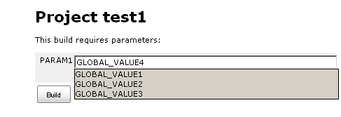
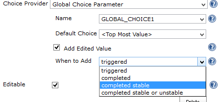

[.conf-macro .output-inline]# #

[.aui-icon .aui-icon-small .aui-iconfont-info .confluence-information-macro-icon]##

Older versions of this plugin may not be safe to use. Please review the
following warnings before using an older version:

* https://jenkins.io/security/advisory/2017-04-10/[Arbitrary code
execution vulnerability]

This plugin adds "Extensible Choice" as a build parameter.You can select
how to retrieve choices, including the way to share choices among all
jobs.

[[ExtensibleChoiceParameterplugin-What'sthis?]]
== What's this?

This plugin provides a Extensible Choice parameter:

* When building, the value can be selected with a dropdown like a
built-in Choice parameter.
* The choices can be provided in several ways:
** Global Choice Parameter: defines choices in the Configure System
page.
*** Choices can be shared by multiple jobs.
*** Updating the choices in the Configure System, every job can
immediately refer the updated choices.
** Textarea Choice Parameter: writes choices in a textarea, just like a
built-in Choice parameter.
** System Groovy Script Choice Parameter: runs a System Groovy script to
determine the list of choices
** File Choice Parameter: lists files in a directory.
* Checking Editable checkbox allows you to specify any value, even one
not in the choices.
** Edited values can be added to the choice used next time automatically
by checking "Add Edited Value".
* You can add a new way to provide choices with Extension Points.

[[ExtensibleChoiceParameterplugin-Disablingproviders]]
== Disabling providers

Some choice providers may cause security issues in your system:

[cols=",,",options="header",]
|===
|Choice Provider |Security Issue |Note
|File Choice Parameter |Any users with project configuration privilege
can list files in the OS with the privilege of the OS user Jenkins run
with. |Users can do that also with "Execute shell" or "Execute Windows
Batch" build step.
|===

You can disable specific providers in system configuration page:

[.confluence-embedded-file-wrapper]##

In the above screen, System Groovy Script Choice Parameter (unchecked
one) is disabled.

[[ExtensibleChoiceParameterplugin-Screenshots]]
== Screenshots

* "Extensible Choice" is added as a type of build parameters. +
[.confluence-embedded-file-wrapper .image-center-wrapper]##
* You can select the way to define choices of the parameter. +
[.confluence-embedded-file-wrapper .image-center-wrapper]##**
A new way to provide choices can be added with Extension Points.
* Selecting "Textarea Choice Parameter", you can define choices like the
built-in Choice parameter. +
[.confluence-embedded-file-wrapper .image-center-wrapper]##
* "Global Choice Parameter" enables you to select a set of choices from
the ones defined in System Configuration page.
** Defining in System Configuration page: +
[.confluence-embedded-file-wrapper .image-center-wrapper]#image:docs/images/sc4_globalchoice1.png[image]#
** Select which set of choices to use: +
[.confluence-embedded-file-wrapper .image-center-wrapper]##
* "System Groovy Choice Parameter" generate choices with a Groovy
script: +
[.confluence-embedded-file-wrapper .image-center-wrapper]##
* "File Choice Parameter" enables select a file in a specified
directory: +
[.confluence-embedded-file-wrapper .image-center-wrapper]##
* You can specify its default value. This is useful with Global Choice
Parameter to specify different default values in jobs: +
[.confluence-embedded-file-wrapper .image-center-wrapper]##
* Checking "Editable" enables you to input a value not in choices at
build time: +
[.confluence-embedded-file-wrapper .image-center-wrapper]##**
Textarea Choice Parameter and Global Choice Parameter provides "Add
Edited Value", which automatically adds a value not in the choice
list: +
[.confluence-embedded-file-wrapper .image-center-wrapper]##

[[ExtensibleChoiceParameterplugin-Extensionpoint]]
== Extension point

A new way to provide choices can be added with extending
`+ChoiceListProvider+`, overriding the following method:

[source,syntaxhighlighter-pre]
----
abstract public List<String> getChoiceList()
----

[[ExtensibleChoiceParameterplugin-Issues]]
== Issues

https://issues.jenkins-ci.org/issues/?jql=project%20%3D%20JENKINS%20AND%20status%20in%20(Open%2C%20%22In%20Progress%22%2C%20Reopened%2C%20%22In%20Review%22%2C%20Verified)%20AND%20component%20%3D%20%27extensible-choice-parameter-plugin%27%20%20%20[Open
Issues]

To report a bug or request an enhancement to this plugin please create a
ticket in JIRA (you need to login or to sign up for an account). Also
have a look on
https://wiki.jenkins.io/display/JENKINS/How+to+report+an+issue[How to
report an issue]

* https://issues.jenkins-ci.org/secure/CreateIssueDetails!init.jspa?pid=10172&issuetype=1&components=17512&priority=4&assignee=ikedam[Bug
report]
* https://issues.jenkins-ci.org/secure/CreateIssueDetails!init.jspa?pid=10172&issuetype=4&components=17512&priority=4[Request
or propose an improvement of existing feature]
* https://issues.jenkins-ci.org/secure/CreateIssueDetails!init.jspa?pid=10172&issuetype=2&components=17512&priority=4[Request
or propose a new feature]

 

[[ExtensibleChoiceParameterplugin-ChangeLog]]
== Change Log

[[ExtensibleChoiceParameterplugin-Version1.6.0(May20,2018)]]
=== Version 1.6.0 (May 20, 2018)

* Add an option to switch the behavior of input value when the input is
editable
(https://wiki.jenkins.io/display/JENKINS/Extensible+Choice+Parameter+plugin[JENKINS-22316],
https://issues.jenkins-ci.org/browse/JENKINS-50315[JENKINS-50315])
** You can select "Display all choices" (the behavior same to Extensible
Choice Paramter <= 1.4.2) or "Display only matching choices" (the
behavior same to Extensible Choice Paramter 1.5.0).
** "Display all choices" is the default behavior.

[[ExtensibleChoiceParameterplugin-Version1.5.0(Mar17,2018)]]
=== Version 1.5.0 (Mar 17, 2018)

* Filter options by input when the input is editable
(https://issues.jenkins-ci.org/browse/JENKINS-22316[JENKINS-22316])
* Save as more simple configurations
(https://issues.jenkins-ci.org/browse/JENKINS-49210[JENKINS-49210])

[[ExtensibleChoiceParameterplugin-Version1.4.2(Jan27,2018)]]
=== Version 1.4.2 (Jan 27, 2018)

* Compatible with Jenkins >= 2.102
(https://issues.jenkins-ci.org/browse/JENKINS-49017[JENKINS-49017]) +
** See https://jenkins.io/blog/2018/01/13/jep-200/[JEP-200] for more
details
* Fix typo
(https://github.com/jenkinsci/extensible-choice-parameter-plugin/pull/32[PR
#32])

[[ExtensibleChoiceParameterplugin-Version1.4.1(Aug27,2017)]]
=== Version 1.4.1 (Aug 27, 2017)

* FIXED: HTML in description is always escaped
(https://issues.jenkins-ci.org/browse/JENKINS-42903[JENKINS-42903])
* Fix typo
(https://github.com/jenkinsci/extensible-choice-parameter-plugin/pull/29/files[PR
#29])

[[ExtensibleChoiceParameterplugin-Version1.4.0(Apr10,2017)]]
=== Version 1.4.0 (Apr 10, 2017)

* SECURITY FIX:
https://jenkins.io/security/advisory/2017-04-10/#extensible-choice-parameter-plugin[Jenkins
Security Advisory 2017-04-10#Extensible Choice Parameter Plugin]
** Groovy scripts run with
https://wiki.jenkins.io/display/JENKINS/Script+Security+Plugin[Script
Security Plugin]
** Existing scripts are configured to run in the script sandbox.
** You might require approve some methods for the sandbox, or configure
scripts run without the sandbox and approve scripts.
* Targets Jenkins >= 1.580.1.
* The pre-defined variable 'jenkins' is no longer provided.
** You can get Jenkins instance with `+jenkins.model.Jenkins.instance+`
instead. Require appropriate approving.

[[ExtensibleChoiceParameterplugin-Version1.3.4(Jan28,2017)]]
=== Version 1.3.4 (Jan 28, 2017)

* Use the top most value if the specified default parameter isn't
contained in the choice list.
** Note: Builds fail if you passed a value not contained in the choice
list explicitly (e.g. via Parameterized trigger plugin).

[[ExtensibleChoiceParameterplugin-Version1.3.3(Oct22,2016)]]
=== Version 1.3.3 (Oct 22, 2016)

* FIXED: "Top Most Value" is replaced with an empty value when saved
before the job configuration page is completed to be load
(https://issues.jenkins-ci.org/browse/JENKINS-37147[JENKINS-37147])

[[ExtensibleChoiceParameterplugin-Version1.3.2(Aug23,2015)]]
=== Version 1.3.2 (Aug 23, 2015)

* Fixed UnsupportedOperationException when Empty Choice is configured
for File Choice Parameter
(https://issues.jenkins-ci.org/browse/JENKINS-29934[JENKINS-29934])
* Improved the help of Exclude Pattern of File Choice Parameter.

[[ExtensibleChoiceParameterplugin-Version1.3.1(Jun20,2015)]]
=== Version 1.3.1 (Jun 20, 2015)

* Fixed NPE with "List Files Now" in configuration pages
(https://issues.jenkins-ci.org/browse/JENKINS-28841[JENKINS-28841],
regression in 1.3.0)

[[ExtensibleChoiceParameterplugin-Version1.3.0(May05,2015)]]
=== Version 1.3.0 (May 05, 2015)

* Now you can disable specific providers in system configuration page
(https://issues.jenkins-ci.org/browse/JENKINS-27375[JENKINS-27375]).
** See
https://wiki.jenkins.io/display/JENKINS/Extensible+Choice+Parameter+plugin#ExtensibleChoiceParameterplugin-Disablingproviders[#Disabling
providers] for details.
* Validates parameter names by checking they can be handled by Jenkins
core
(https://issues.jenkins-ci.org/browse/JENKINS-22222[JENKINS-22222]).
* Fixed "Error: No stapler-class is specified" when saving project
configuation with Jenkins
1.610(https://issues.jenkins-ci.org/browse/JENKINS-28046[JENKINS-28046]).
** Dot letters are allowed for variable names with Jenkins > 1.526.
* Added an empty choice option to FilenameChoiceListProvider
(https://issues.jenkins-ci.org/browse/JENKINS-22318[JENKINS-22318]).
* Also accepts $class introduced in Jenkins 1.588
(https://issues.jenkins-ci.org/browse/JENKINS-25403[JENKINS-25403]).

[[ExtensibleChoiceParameterplugin-Version1.2.2(Dec08,2013)]]
=== Version 1.2.2 (Dec 08, 2013)

* Added feature to use `+project+` in System Groovy Script.
https://issues.jenkins-ci.org/browse/JENKINS-17875[JENKINS-17875]
* Added feature to reverse file lists.

[[ExtensibleChoiceParameterplugin-Version1.2.1(Jun22,2013)]]
=== Version 1.2.1 (Jun 22, 2013)

* Added documents for System Groovy Script Choice Parameter.
* Added "Run the Script Now" Button for System Groovy Script Choice
Parameter.

[[ExtensibleChoiceParameterplugin-Version1.2.0(May03,2013)]]
=== Version 1.2.0 (May 03, 2013)

* Added new providers
** System Groovy Script Choice Parameter: runs a System Groovy script to
determine the list of choices
** File Choice Parameter: lists files in a directory.
* Added checkbox "Add Edited Value" to Textarea Choice Parameter and
Global Choice Parameter. By checking this, edited values used in builds
are automatically added to choices.

[[ExtensibleChoiceParameterplugin-Version1.1.0(Feb06,2013)]]
=== Version 1.1.0 (Feb 06, 2013)

* Now you can select the default choice in each job.
* Fixed the misspell.

[[ExtensibleChoiceParameterplugin-Version1.0.0(Jan07,2013)]]
=== Version 1.0.0 (Jan 07, 2013)

* Initial release.
